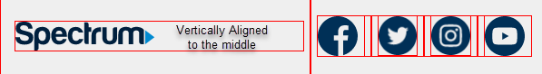

# Spectrum Marketing Email
This is recreation of the marketing email I found recently in my own mailbox. Looking at this one, compared to the rest, seemed to stand out. It loaded fast, and wasn't just text, or just pictures. It was the right balance of both, so I wish to recreate it to see if I can achieve this. 

## Screenshot
This is a screenshot of the full page. I will go purely by this image and not look at the code from gmail, as it gmail adds their own code, and to practice using the [Foundations Email](https://github.com/foundation/foundation-emails) framework, as for the most part, it does save some time when compared to creating tables, rows and columns manually!.


## Remaining items
- [ ]  Turn Telephone numbers to real links
- [ ] Move static text into data files (JSON)

## Current Result

coming soon....

## Colors used
```
dark blue : #003057;
blue text: #0099d8;
orange text: #faa41a;
footer grey: #EFEFEF;

```

## Technologies used
* Zurb's [Foundations Email framework](https://github.com/foundation/foundation-emails).
* HTML
* CSS (SASS)
* Javascript (through Panini)
---
## Helpers
~~A simple helper, since I noticed it was repeated code throughout. Just adding a place for someone to add a phone number so it is styled as intended. If the number were to ever change, just replace the number between the handlbar code.~~
Originally I thought a phone number helper would be useful. When creating the JSON file, I decided it would be easier to move the number the JSON file, which allowed me to better control the styling, since the phone number has 2 different styles in the email, though its placed in 3 sections.

**NO LONGER IN USE - Leaving for historical reason**
```js
module.exports = function(phoneNumber){
    const blueBoldText = `<p class="text-center call">or call ${phoneNumber.fn(this)}</p>`;
    return blueBoldText;
}
```
```html
{{#phoneNumber}}1-877-959-1755{{/phoneNumber}}
```
---
# Tips 'n Tricks
Below are some tricks based on the Foundations documentation, or some that aren't.
## Centering
There's a lot to this, depending on the situation. A couple I'll highlight for my own sake in the future.
1. Vertical Alignment (for mobile): Target the `<column>`, as it acts as the `<th>` tag once compiled. 



```css
.spectrum-logo__container{
      vertical-align: middle;
```
```html
<row class="footer">
        <columns large="4" small="12" class="spectrum-logo__container">
            <a href="{{spectrumData}}.marketingLink}}"></a>
        </columns>
```

## Padding
Usually adding a class to each row and column helps with this, but sometimes the framework is stubborn. In the case of the header, when in mobile view, it would add the default 16px padding left and right, even though I overwrote the rule. The solution was to add the HTML element **plus** the class name.


**Solution**
```css
.email-header{
    /* Adding the **th** selector with the class name fixed the padding issue */
  th.header-column{
    padding-right: 0px !important;
    padding-left: 0px !important;
    @media only screen and (max-width:#{$global-breakpoint}){
      padding-right: 0px !important;
      padding-left: 0px !important;
      }
    }
  }

```


## Dynamic Data
From looking at the other marketing emails from Spectrum, it seems like the only items that don't change as far as design is concerned is the footer. Therefore, I will move the links and telephone numbers, and footer text to the data file for panini to handle.


# Copyright Notice
I do not claim ownership the design, or any of the logos within this project. This is purely for educational purposes.# spectrum-email-mockup
